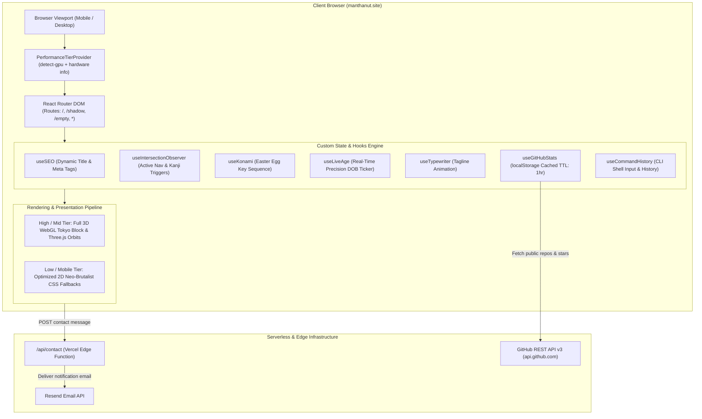
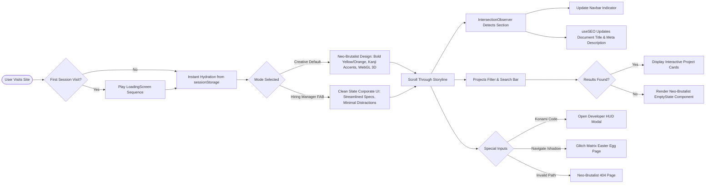

# ⚡ Manthan Utekar — Portfolio

> High-performance, Neo-Brutalist interactive portfolio engineered with **React 18**, **Three.js**, **Tailwind CSS 4**, **Vite 5**, and **Vercel Edge Functions**. Features real-time GPU performance tiering, dual Recruiter/Creative presentation modes, an interactive CLI terminal, and dynamic SEO synchronization.

[](https://manthanut.site)
[](https://react.dev/)
[](https://www.typescriptlang.org/)
[](https://vitejs.dev/)
[](https://tailwindcss.com/)
[](https://threejs.org/)
[](LICENSE)

---

## 📑 Table of Contents

- [1. System Architecture](#1-system-architecture)
- [2. Frontend Component Hierarchy](#2-frontend-component-hierarchy)
- [3. User Flow & Routing Architecture](#3-user-flow--routing-architecture)
- [4. Repository Directory Structure](#4-repository-directory-structure)
- [5. Core Features & Capabilities](#5-core-features--capabilities)
- [6. Environment Configuration](#6-environment-configuration)
- [7. Local Development Guide](#7-local-development-guide)
- [8. Production Build & Deployment](#8-production-build--deployment)

---

## 1. System Architecture

The application adopts a **JAMstack Single-Page Architecture** paired with **Vercel Edge Serverless Functions** for backend email delivery and client-side cached API integrations.



---

## 2. Frontend Component Hierarchy

The visual and logic tree splits into global modal overlays, an adaptive navigation shell, scrollable narrative sections, and lazy-loaded WebGL modules.

```mermaid
graph TD
    App["App.tsx (Root Container)"] --> Provider["PerformanceTierProvider"]
    Provider --> Router["BrowserRouter"]
    Router --> RoutesTree["Routes"]

    RoutesTree --> MainRoute["Route: / (MainPortfolio)"]
    RoutesTree --> ShadowRoute["Route: /shadow (ShadowPage Matrix)"]
    RoutesTree --> EmptyRoute["Route: /empty (EmptyStatePage)"]
    RoutesTree --> NotFoundRoute["Route: * (NotFound 404)"]

    subgraph MainPortfolioComponents["MainPortfolio Layout & Sections"]
        MainRoute --> Gate["LoadingScreen (sessionStorage Gate)"]
        MainRoute --> Kanji["KanjiOverlay (Section Flash Transition)"]
        MainRoute --> KonamiOverlay["KonamiOverlay (Dev HUD Modal)"]
        MainRoute --> HMToggle["HMModeToggle (Recruiter Mode Floating FAB)"]
        MainRoute --> Nav["Navbar (Desktop Menu + Mobile Slide Drawer)"]
        
        MainRoute --> Hero["Hero Section (Live Age, Tagline, Availability)"]
        MainRoute --> M1["MarqueeStrip"]
        MainRoute --> AboutLazy["About Section (Lazy: Tokyo 3D / Heatmap / Stats)"]
        MainRoute --> M2["MarqueeStrip"]
        MainRoute --> Skills["Skills Section (3D Orbital Tech Cloud / Grid)"]
        MainRoute --> M3["MarqueeStrip"]
        MainRoute --> Projects["Projects Section (Filter Tabs, Cards, EmptyState)"]
        MainRoute --> M4["MarqueeStrip"]
        MainRoute --> TerminalLazy["Terminal Section (Lazy: CLI / Cinematic / Specs)"]
        MainRoute --> M5["MarqueeStrip"]
        MainRoute --> ContactSec["Contact Section (Validated Edge Form)"]
        MainRoute --> Foot["Footer (Social Links, Domain Status)"]
    end
```



---

## 3. User Flow & Routing Architecture



---

## 4. Repository Directory Structure

```text
my-portfolio/
├── .agents/                        # Agent workflows and graphify knowledge rules
│   ├── rules/                      # Graphify graph sync instructions
│   └── workflows/                  # Workflow definitions
├── api/                            # Vercel Edge Serverless functions
│   ├── contact.ts                  # Edge handler for contact form submissions (Resend)
│   └── send-email.js               # Node.js fallback mail sender
├── docs/                           # Project specifications & architecture blueprints
│   ├── INFORMATION ARCHITECTURE.md # Content layout, UX flows, and copy guidelines
│   ├── prd.md                      # Product Requirements Document
│   ├── SYSTEM ARCHITECTURE.md      # Technical architecture specification
│   └── USER STORIES & ACCEPTANCE CRITERIA.md # QA test scenarios
├── public/                         # Static production assets
│   ├── apple-touch-icon.png        # 180x180 iOS home screen icon
│   ├── favicon.ico                 # Legacy browser favicon
│   ├── favicon.svg                 # Scalable Neo-Brutalist SVG favicon
│   ├── icons.svg                   # SVG sprite definitions
│   ├── og-image.png                # Social share OpenGraph card (1200x630)
│   ├── quiz-image.png              # Project screenshot asset
│   ├── react-animation.png         # Project screenshot asset
│   └── resume.pdf                  # Curated software engineer resume
├── src/
│   ├── assets/                     # Packaged static media and artwork
│   ├── components/                 # Reusable UI elements
│   │   ├── EmptyState.tsx          # Reusable neo-brutalist empty state widget
│   │   ├── HMModeToggle.tsx        # Hiring Manager mode switch button
│   │   ├── KanjiOverlay.tsx        # Cinematic Japanese character section flash
│   │   ├── KonamiOverlay.tsx       # Developer easter-egg retro HUD modal
│   │   ├── LoadingScreen.tsx       # First-load animated splash screen
│   │   ├── MarqueeStrip.tsx        # High-velocity ticker tape divider
│   │   └── Navbar.tsx              # Responsive navbar with mobile slide drawer
│   ├── context/                    # React Context providers
│   │   └── PerformanceTier.tsx     # GPU tier detection ('high' | 'mid' | 'low' | 'mobile')
│   ├── hooks/                      # Custom logic & side-effect hooks
│   │   ├── useCommandHistory.ts    # Terminal CLI history & arrow-key traversal
│   │   ├── useGitHubStats.ts       # GitHub API integration with localStorage caching
│   │   ├── useIntersectionObserver.ts # Section tracking & active nav synchronization
│   │   ├── useKonami.ts            # Key sequence detector (↑↑↓↓←→←→BA)
│   │   ├── useLiveAge.ts           # Real-time age ticker calculated from birth date
│   │   ├── useSEO.ts               # Dynamic document title & meta tag injector
│   │   └── useTypewriter.ts        # Typing and backspace text animator
│   ├── sections/                   # Primary page & layout views
│   │   ├── About.tsx               # Narrative biography, Tokyo 3D block & heatmaps
│   │   ├── Contact.tsx             # Contact form with live validation & direct channels
│   │   ├── EmptyStatePage.tsx      # Standalone route showcase for empty states (/empty)
│   │   ├── Footer.tsx              # Colophon, copyright, and external social links
│   │   ├── Hero.tsx                # Fold showcase with availability status & live age
│   │   ├── NotFound.tsx            # Neo-brutalist 404 error page (*)
│   │   ├── Projects.tsx            # Filterable project showcase & live demo links
│   │   ├── ShadowPage.tsx          # Hidden hacker/matrix easter egg route (/shadow)
│   │   ├── Skills.tsx              # Categorized tech cloud with 3D/2D orbit modes
│   │   └── Terminal.tsx            # Interactive CLI environment & system diagnostic
│   ├── App.css                     # Global utility animations
│   ├── App.tsx                     # Main layout coordinator, routes, and suspense gates
│   ├── index.css                   # Tailwind CSS v4 setup and brand color tokens
│   └── main.tsx                    # React DOM entry point
├── .env.example                    # Environment variable template
├── eslint.config.js                # ESLint configuration
├── index.html                      # HTML template with SEO meta tags & favicon links
├── package.json                    # Dependencies and npm scripts
├── tsconfig.json                   # TypeScript configuration
├── tsconfig.app.json               # Frontend TypeScript compiler options
├── tsconfig.node.json              # Node environment TypeScript compiler options
└── vite.config.ts                  # Vite bundler configuration with Tailwind plugin
```

---

## 5. Core Features & Capabilities

### 🎨 1. Neo-Brutalist Design System
- Hard-edge 3px solid borders (`#0C4A6E` Navy), high-contrast shadow offsets (`shadow-[4px_4px_0px_0px_#0C4A6E]`), and tactile active press states.
- Carefully curated color palette:
  - `#FDE047` — Cyber Yellow (Primary canvas)
  - `#FE6334` — Brutalist Orange (Call to actions & highlights)
  - `#0C4A6E` — Deep Navy (Structural borders, text, and shadows)
  - `#D9F99D` — Acid Lime (Accents & secondary badges)
  - `#C0F0F5` — Soft Cyan (Info cards & terminal highlights)
  - `#FFA6B5` — Bubblegum Pink (Stickers & badges)

### 👔 2. Recruiter / Hiring Manager Mode
- Accessible via the persistent floating toggle or navigation bar.
- Instantly refactors the page into a crisp, corporate, slate-toned UI without playful visual clutter, allowing recruiters to review credentials, architecture case studies, and engineering competencies in seconds.

### 🎮 3. Interactive CLI Terminal
- Realistic terminal emulator built directly into the page.
- Features command history, auto-scroll, scanlines, and commands:
  - `help` — List all available commands
  - `skills` — Output core engineering competencies
  - `projects` — Display repository catalog
  - `cat resume.txt` — View resume highlights
  - `clear` — Clear terminal buffer
  - `theme` — Toggle color schemes

### 📱 4. Mobile First & Zero Horizontal Overflow
- Completely audited for viewport sizes from 375px up to 4K ultra-wide monitors.
- Full-screen animated slide-over drawer on mobile devices with body-scroll locking, one-tap resume download, and recruiter mode toggle.

### 🔍 5. Dynamic SEO & Tab Synchronization
- Dynamically shifts `<title>` and `<meta name="description">` tags as the user scrolls through each section.
- Detects window blur/focus events to engage returning visitors (`👀 Don't leave yet! — Manthan Utekar`).

---

## 6. Environment Configuration

Create a `.env` file in the root directory modeled after `.env.example`:

```bash
# GitHub Profile Integration
VITE_GITHUB_USERNAME=manthanut27

# LinkedIn Social Link
VITE_LINKEDIN_URL=https://linkedin.com/in/utkmanthan

# Contact Email
VITE_CONTACT_EMAIL=contact@manthanut.site

# Projects Git Repository Links
VITE_GITHUB_REPO_EVA_BLOOM=https://github.com/manthanut27/eva-bloom
VITE_GITHUB_REPO_BMW=https://github.com/manthanut27/bmw-m4-showcase
VITE_GITHUB_REPO_QUIZ=https://github.com/manthanut27/quiz
VITE_GITHUB_REPO_REACT_ANIMATIONS=https://github.com/manthanut27/react-animation

# Projects Live Demo Links
VITE_LIVE_LINK_EVA_BLOOM=https://evabloom.in
VITE_LIVE_LINK_BMW=https://bmw-m4.manthanut.site
VITE_LIVE_LINK_QUIZ=https://quiz.manthanut.site
VITE_LIVE_LINK_REACT_ANIMATIONS=https://react-animation-xi.vercel.app

# Production Resend API Key (for /api/contact edge function)
RESEND_API_KEY=re_your_resend_api_key

# Resend Sender Email
RESEND_FROM_EMAIL=contact@manthanut.site
```

---

## 7. Local Development Guide

### Prerequisites
- **Node.js**: `v18.0.0` or higher
- **npm**: `v9.0.0` or higher (or pnpm / yarn)

### 1. Clone & Install Dependencies
```bash
git clone https://github.com/manthanut27/my-portfolio.git
cd my-portfolio
npm install
```

### 2. Start the Local Development Server
```bash
npm run dev
```
The site will start at `http://localhost:5173/` (or next available port) with instant Hot Module Replacement (HMR).

### 3. Run Linter
```bash
npm run lint
```

---

## 8. Production Build & Deployment

### Build for Production
```bash
npm run build
```
This runs TypeScript project compilation (`tsc -b`) and bundles optimized static assets into `dist/` via Vite.

### Preview Production Build
```bash
npm run preview
```

### Vercel Deployment
The repository is pre-configured for Vercel deployment:
1. Connect the repository to [Vercel](https://vercel.com).
2. Set Framework Preset to **Vite**.
3. Add environment variables (`RESEND_API_KEY`, `VITE_GITHUB_USERNAME`, etc.).
4. The serverless functions in `api/contact.ts` automatically deploy to the **Vercel Edge Network**.

---

<div align="center">
  <p>Crafted with ⚡ and Neo-Brutalist precision by <strong>Manthan Utekar</strong></p>
  <p><a href="https://manthanut.site">manthanut.site</a> · <a href="mailto:contact@manthanut.site">contact@manthanut.site</a></p>
</div>
